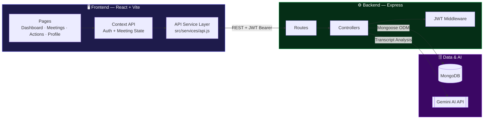
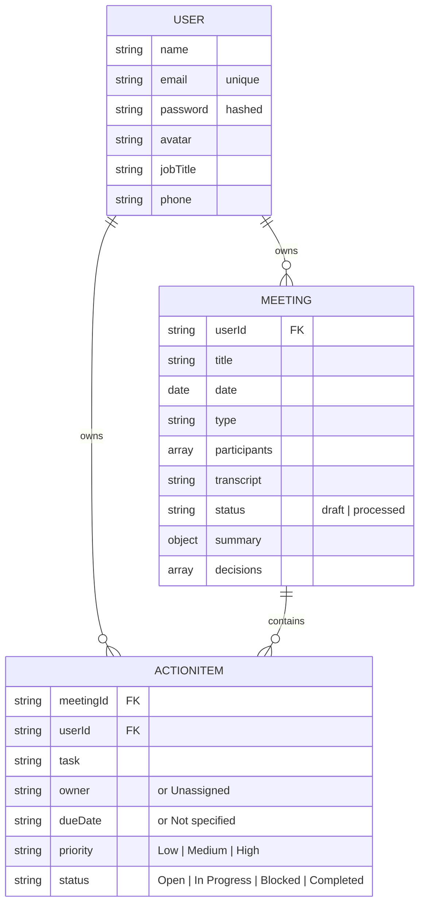
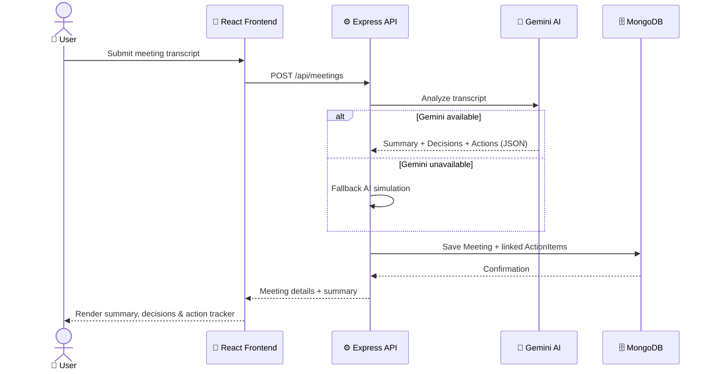

<div align="center">


<br/>


</div>

---

## 📌 Table of Contents

- [Overview](#-overview)
- [Core Features](#-core-features)
- [Tech Stack](#-tech-stack)
- [Architecture](#-architecture)
- [Application Structure](#-application-structure)
- [Backend Details](#-backend-details)
- [Database Schema](#-database-schema)
- [Transcript Processing Flow](#-transcript-processing-flow)
- [API Reference](#-api-reference)
- [Getting Started](#-getting-started)
- [Environment Variables](#-environment-variables)
- [Development Scripts](#-development-scripts)
- [Known Limitations](#-known-limitations)
- [Roadmap](#-roadmap)
- [License](#-license)

---

## 🚀 Overview

**Zignuts AI Meeting Tracker** is a full-stack web application that turns raw meeting transcripts into structured, actionable data. Drop in a transcript, and the app uses **Gemini AI** to generate summaries, extract key decisions, and surface action items — complete with owners, due dates, and priorities.

The project is split into two independently runnable parts:

| Layer | Path | Responsibility |
|---|---|---|
| 🎨 **Frontend** | `src/` | React app — routing, theming, auth, meeting workflows, action management |
| ⚙️ **Backend** | `server/` | Express API — MongoDB persistence, JWT auth, meeting/action CRUD, AI processing |

---

## ✨ Core Features

<table>
<tr>
<td width="50%" valign="top">

### 🎨 Frontend
- 🔐 Full auth flow — login, register, logout
- 🛡️ Protected, client-side routed app pages
- 🌗 Theme switching + responsive UI
- 📊 Dashboard with meeting & task metrics
- 🔍 Meeting list, search, and detail views
- 📝 Create meetings from transcripts + participants
- 🤖 View AI-generated summaries & decisions
- ✅ Action tracker — status + priority management
- 👤 Profile management page
- 🔔 Toast notifications & polished UX feedback

</td>
<td width="50%" valign="top">

### ⚙️ Backend
- 🔑 Secure JWT-authorized Express API
- 🗄️ MongoDB persistence for users, meetings, actions
- 📋 Structured AI summaries + decisions per meeting
- 🔗 Action items linked to meetings
- 👤 Profile retrieval & update endpoints
- 🧠 Gemini AI integration for transcript analysis
- 🧪 Fallback AI simulation when Gemini is unavailable

</td>
</tr>
</table>

---

## 🛠 Tech Stack

<div align="center">

</div>

---

## 🏗 Architecture



---

## 📂 Application Structure

<details>
<summary><b>Click to expand full folder tree</b></summary>

```
zignuts-ai-meeting-tracker/
│
├── src/                          # Frontend (React + Vite)
│   ├── App.jsx                   # Main router & provider composition
│   ├── context/
│   │   ├── AuthContext.jsx       # Auth state + token persistence
│   │   └── MeetingContext.jsx    # Meeting/action state + API orchestration
│   ├── services/
│   │   └── api.js                # Frontend ↔ backend API client
│   ├── pages/                    # Dashboard, MeetingList, MeetingCreate,
│   │                              # MeetingDetails, ActionTracker, Profile, Login, Register
│   └── components/                # UI components, layout, widgets, cards, tables, modals
│
└── server/                       # Backend (Express + MongoDB)
    ├── server.js                 # Express entry point
    ├── config/
    │   └── db.js                 # MongoDB connection
    ├── models/                   # User, Meeting, ActionItem schemas
    ├── routes/                   # auth, profile, meetings, actions
    ├── controllers/              # Business logic per resource
    ├── utils/
    │   └── geminiAi.js           # Gemini transcript processing + normalization
    └── middleware/
        └── authMiddleware.js     # JWT request guard
```

</details>

---

## ⚙️ Backend Details

The API is an Express 5 application started from `server/server.js`. It loads `server/.env`, initiates a MongoDB connection, parses JSON request bodies up to 10 MB, and mounts resource routers under `/api`. Controllers own request validation and resource operations; Mongoose models define persisted data; authentication middleware protects user-specific routes.

### Authentication and data ownership

- `POST /api/auth/register` and `POST /api/auth/login` are public. Passwords are hashed with `bcryptjs`; successful responses include a JWT and a password-free user object.
- Tokens are signed with `JWT_SECRET`, expire after 30 days, and are sent as `Authorization: Bearer <token>`.
- Profile, meeting, action-item, and dashboard-stat routes require a valid token. Their database queries are scoped to the authenticated user's ID, including reads, updates, and deletes.
- Creating an action item requires a meeting owned by the same user. Deleting a meeting also deletes its associated action items.

### Meeting and AI processing

`POST /api/meetings` requires `title`, `date`, and `transcript`. The API sends the transcript to Gemini, normalizes the result into a summary, decisions, and action items, then stores the meeting and generated actions. The accepted summary fields are `purpose`, `discussionPoints`, `outcomes`, `concerns`, and `nextSteps`. Action-item priorities are `Low`, `Medium`, or `High`; statuses are `Open`, `In Progress`, `Blocked`, or `Completed`.

The optional `GEMINI_MODEL` setting accepts `gemini-flash-latest` or `gemini-2.5-flash`. The backend tries the other supported model when a model is reported unavailable. If AI processing still fails, it returns a built-in sample result so meeting creation can complete; that fallback is illustrative data, not an analysis of the supplied transcript.

### Dashboard statistics

`GET /api/actions/stats` returns the current user's meeting and action-item totals, counts for non-completed (`Open`, `In Progress`, or `Blocked`), completed, and overdue actions, and up to five most recent meetings. An action is overdue when its due date is before today and its status is not `Completed`.

### Errors and operational notes

Responses use JSON. Missing or invalid authentication returns `401`; malformed IDs return `400`; unknown or non-owned resources return `404`; duplicate values and schema validation errors return `400`. Other failures return `500` unless an error provides a status code. CORS currently allows requests from any origin, so production deployments should restrict it to the intended frontend origin.

---

## 🗄 Database Schema



---

## 🔄 Transcript Processing Flow



---

## 📡 API Reference

All endpoints use the `/api` prefix. Register, login, and the health check are public; all profile, meeting, action-item, and stats endpoints require `Authorization: Bearer <token>`. Requests and responses use JSON.

<details>
<summary><b>🔐 Authentication</b></summary>

| Method | Endpoint | Description |
|:---:|---|---|
| `POST` | `/api/auth/register` | Create a new user |
| `POST` | `/api/auth/login` | Authenticate and receive a JWT token |

</details>

<details>
<summary><b>👤 Profile</b></summary>

| Method | Endpoint | Description |
|:---:|---|---|
| `GET` | `/api/profile` | Get current user's profile |
| `PUT` | `/api/profile` | Update profile data and password |

</details>

<details>
<summary><b>📅 Meetings</b></summary>

| Method | Endpoint | Description |
|:---:|---|---|
| `GET` | `/api/meetings` | List authenticated user's meetings |
| `GET` | `/api/meetings/:id` | Fetch meeting details and actions |
| `POST` | `/api/meetings` | Create a meeting and process transcript |
| `PUT` | `/api/meetings/:id` | Update meeting fields |
| `DELETE` | `/api/meetings/:id` | Remove a meeting and related actions |

</details>

<details>
<summary><b>✅ Action Items</b></summary>

| Method | Endpoint | Description |
|:---:|---|---|
| `GET` | `/api/actions` | List action items with optional filters |
| `POST` | `/api/actions` | Create an action item |
| `PUT` | `/api/actions/:id` | Update action item fields |
| `DELETE` | `/api/actions/:id` | Delete an action item |
| `GET` | `/api/actions/stats` | Get dashboard totals, action counts, and recent meetings |

`GET /api/meetings?search=<term>` searches meeting titles, transcripts, purpose, and summaries. `GET /api/actions` accepts `status`, `priority`, `owner`, and `search` query parameters; search matches task and owner text.

</details>

<details>
<summary><b>❤️ Health Check</b></summary>

| Method | Endpoint | Description |
|:---:|---|---|
| `GET` | `/api/health` | Server status check |

</details>

---

## ⚡ Getting Started

### Prerequisites


### 1️⃣ Backend Setup

```bash
cd server
npm install
```

Create a `.env` file inside `server/`:

```env
PORT=5000
MONGO_URI=mongodb://127.0.0.1:27017/meeting_tracker
JWT_SECRET=your_jwt_secret
GEMINI_API_KEY=your_gemini_api_key
```

Start the backend:

```bash
npm run dev
```

### 2️⃣ Frontend Setup

```bash
cd ..
npm install
npm run dev
```

Open the app at the URL Vite prints — usually **http://localhost:5173** 🎉

---

## 🔧 Environment Variables

| Variable | Description | Example |
|---|---|---|
| `PORT` | Backend server port | `5000` |
| `MONGO_URI` | MongoDB connection string | `mongodb://127.0.0.1:27017/meeting_tracker` |
| `JWT_SECRET` | Secret used to sign JWT tokens | `your_jwt_secret` |
| `GEMINI_API_KEY` | Google Generative AI API key | `your_gemini_api_key` |
| `GEMINI_MODEL` | Optional supported Gemini model; defaults to `gemini-flash-latest` | `gemini-2.5-flash` |

> 💡 The API URL is currently set to `http://localhost:5000/api` in `src/services/api.js` (it is not read from an environment variable). The frontend stores JWT tokens in `localStorage` and attaches them to API requests. If Gemini is unavailable or processing fails, the backend uses the illustrative fallback described above.

---

## 📜 Development Scripts

<table>
<tr><th>Location</th><th>Command</th><th>Description</th></tr>
<tr><td rowspan="3">Root (frontend)</td><td><code>npm run dev</code></td><td>Start the frontend dev server</td></tr>
<tr><td><code>npm run build</code></td><td>Build frontend for production</td></tr>
<tr><td><code>npm run preview</code></td><td>Preview the production build</td></tr>
<tr><td>Root (frontend)</td><td><code>npm run lint</code></td><td>Run Oxlint on the frontend project</td></tr>
<tr><td rowspan="2"><code>server/</code></td><td><code>npm run start</code></td><td>Start the backend once</td></tr>
<tr><td><code>npm run dev</code></td><td>Start the backend with <code>nodemon</code></td></tr>
</table>

The backend includes a standalone API integration check. Start the backend with MongoDB available, then run this from `server/` in another terminal:

```bash
node scripts/integration-test.js
```

It creates a test user, exercises the main API flows, and removes the test meeting and its action items. The test user remains in the database. This script is not wired to `npm test`; the backend package's `test` command is currently a placeholder.

---

## ⚠️ Known Limitations

- 🚫 No automated frontend test suite is configured
- 🚫 The backend's `npm test` command is a placeholder; use the standalone integration check described above for API coverage
- 🔑 Gemini AI integration requires a valid Google Generative AI API key and supported model
- 🖥️ Assumes a local MongoDB instance by default
- 🌐 Backend CORS currently accepts any origin and should be restricted for production

---

## 🗺 Roadmap

- [ ] Add end-to-end test coverage for critical user flows
- [ ] Implement seed/demo users for easy local testing
- [ ] Add validation and error display in more UI flows
- [ ] Support production deployment configuration for frontend and backend

---

<!-- ## 📄 License

Distributed under the **MIT License**. Feel free to use, modify, and build on top of this project. -->

<div align="center">


**Made with ❤️ using React, Node.js & Gemini AI**

</div>